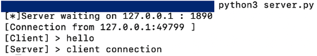
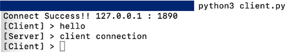

# hands-on-2022

## python 導入方法
- mac編  
git clone or ダウンロードしてきたファイルの中から "python-installer/python-3.10.4-macos11.pkg"を実行し、Pythonをインストールします。
うまくいかない場合、下記の参考ページから導入をお願いします。  
参考ページ
[Python3インストール（Mac編）](https://qiita.com/ms-rock/items/72b8f1abc661c539bb09)


- windows編  
git clone or ダウンロードしてきたファイルの中から "python-installer/python-3.10.4-amd64.exe"を実行し、Pythonをインストールします。
うまくいかない場合、下記の参考ページから導入をお願いします。  
参考ページ
[Windows版Pythonのインストール](https://www.python.jp/install/windows/install.html)


## socket プログラム編
半二重通信のアプリです。(一方が送信しているときは片方が受信に専念します)
- server.py
使い方  
```python:server.py
python3 server.py
```
 

ポートやipアドレスは設定したものに修正しましょう

- client.py
使い方  
```python:client.py
python3 clien.py
```
 

ポートやipアドレスは設定したものに修正しましょう

## wireshark 導入方法
- mac編
以下のコマンドを実行
```
brew cask install wireshark
```

- windows編  
下記の参考ページから導入をお願いします。 
[Wiresharkのインストール手順（Windows編）](https://qiita.com/yasushi-jp/items/7cacbe6089c760ad4202)